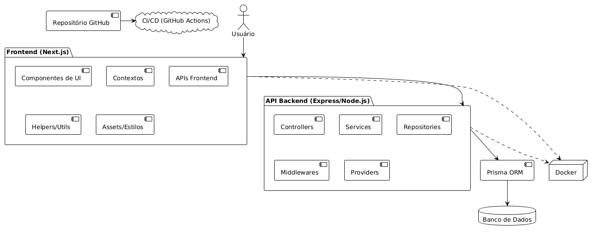

# 1. Arquitetura adotada

O sistema adota uma arquitetura **Cliente-Servidor** com as seguintes características:  

## 1.1 Backend Monolítico com Estrutura em Camadas

- O backend é construído com **Node.js** e **Express**. Utiliza o ORM **Prisma** para acesso ao banco de dados **PostgreSQL**. A autenticação é feita via **JWT**, e o upload de imagens utiliza o **Multer**. 

- O backend é organizado em camadas para separar responsabilidades, como a camada de Roteamento, Middlewares (para autenticação) e Acesso a Dados (abstraído pelo Prisma).

## 1.2 Frontend Desacoplado

- O frontend está em `frontend` e é desenvolvido com **Next.js** (React). Ele consome as APIs do backend via chamadas HTTP usando **Axios**. Para validação de formulários, utiliza **Zod**. O frontend é desacoplado do backend, rodando em seu próprio container Docker e se comunicando apenas por API REST. As páginas e componentes estão organizados em `frontend/src/app`.
Essa separação de contêineres entre o frontend e o backend é orquestrada pelo `docker-compose.yml`.

# 2.
